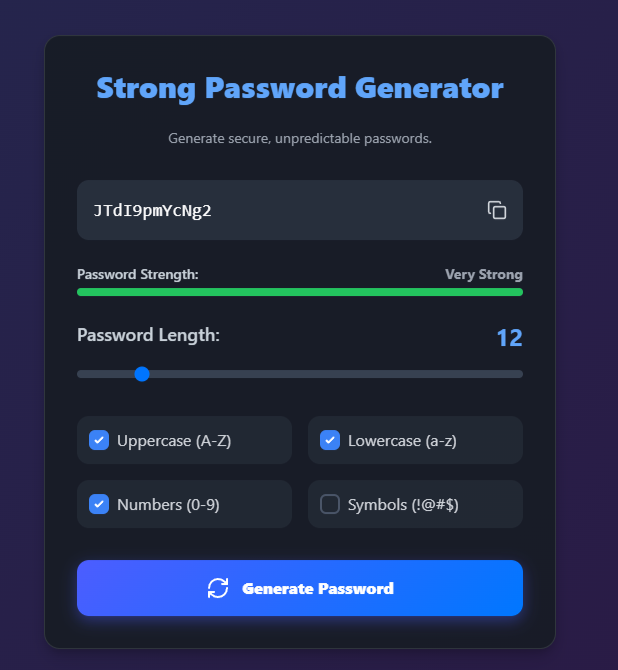

# 🔐 PassGen

A fast, simple, and secure password generator — built and hosted with GitHub Pages.

🔗 **Live demo:** [passgen.github.io](https://passgen.github.io)

## 📸 Screenshot



## ✨ Features

- Generate strong, random passwords instantly
- Customize length and character sets (uppercase, lowercase, numbers, symbols)
- One-click copy to clipboard
- Fully client-side — no data ever leaves your browser
- Clean, responsive UI that works on desktop and mobile
- No installation required, runs entirely in the browser

## 🚀 Getting Started

### Use it online

Just visit [passgen.github.io](https://passgen.github.io) — no setup needed.

### Run it locally

```bash
git clone https://github.com/surenaprojects/passgen.github.io.git
cd passgen.github.io
```

Then open `index.html` in your browser, or serve it locally:

```bash
python -m http.server 8000
```

Visit `http://localhost:8000` in your browser.

## 🛠️ Built With

- HTML5
- CSS3
- JavaScript

## 📂 Project Structure

```
passgen.github.io/
├── index.html
├── style.css
├── script.js
└── README.md
```

## 🤝 Contributing

Contributions, issues, and feature requests are welcome!

1. Fork the project
2. Create your feature branch (`git checkout -b feature/AmazingFeature`)
3. Commit your changes (`git commit -m 'Add some AmazingFeature'`)
4. Push to the branch (`git push origin feature/AmazingFeature`)
5. Open a Pull Request

## 📜 License

This project is licensed under the MIT License — see the [LICENSE](LICENSE) file for details.

## 📬 Contact

**Surena** — [GitHub](https://github.com/surenaprojects) · [Telegram](https://t.me/surenaprojects)

---

⭐ If you find this project useful, consider giving it a star!
